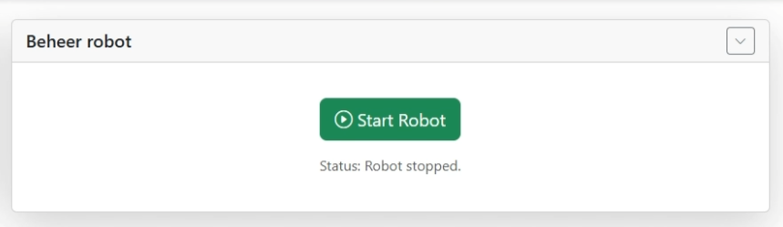
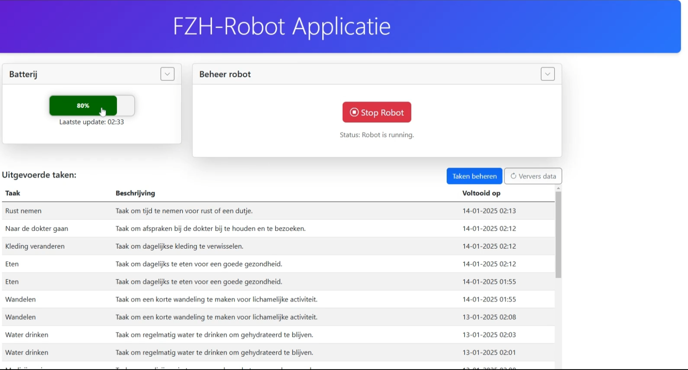
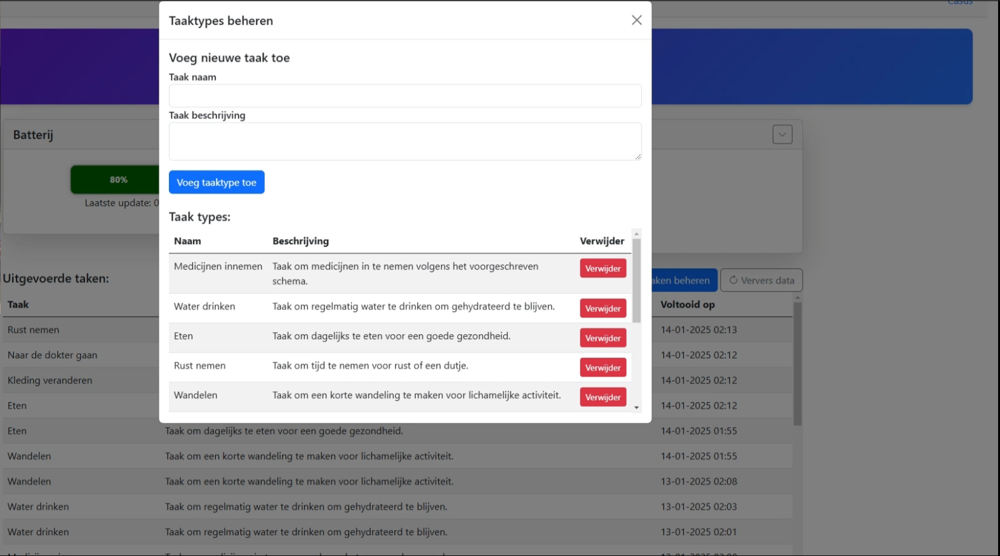

# Avans HBO Jaar 1, Periode 2: ATIx ICT-B1.2 Robotics Prototyping (2024-25)

- (01-11-2024 / 19-01-2025)
- Eindpunt(gemiddelde): **8,6**
- **Stack:** (Blazor, C#, HTML, CSS, Bootstrap, SQL, MQTT)
- Robot door school geleverd, bevat onder andere: `Raspberry Pi` en de `Romi32U4 controller`

## Project Overview
Dit project is het tweede project van mijn opleiding Informatica. De applicatie is ontwikkeld om een robot te besturen en gegevens te verwerken met behulp van MQTT-communicatie. De robot bevat onder andere een Raspberry Pi en de Romi32U4 controller. Om specifieker in te gaan op mijn gekozen casus, via een interface kun je herinneringen/taken toevoegen en deze worden via de robot uitgezonden, dit zou mensen kunnen helpen met zelfstandigheid.

- [Gekozen opdrachtvariant](Assets\Opdrachtomschrijving\FZH_opdrachtomschrijving.pdf)
- [Kick-off project(algemene info)](Assets\Opdrachtomschrijving\kick-off_project.pdf)
- [Verslag opdracht](Assets\Opdrachtomschrijving\Groeidocument_opdracht.pdf)

**Belangrijk**: De applicatie is volledig ontwikkeld rondom de robot en MQTT. Helaas moest de robot worden ingeleverd bij school, waardoor dit project niet verder kon worden uitgebreid. Alles is echter goed gedocumenteerd en grotendeels voltooid zoals gepland.

### Functionaliteit:

1. **Real-time Robotbesturing**:
   - Start/stop de robot via MQTT-opdrachten(aangegeven door "in behandeling"). De status van of de robot rijdt of niet is hier ook te zien.
   
   
   - Stuur en beheer robottaken via de webinterface.

2. **Sensoren en Waarschuwingen**:
   - Monitor afstanden, lichtintensiteit en knoppenstatus.
   
   - Activeer waarschuwingen en stuur meldingen.
   

3. **Webinterface**:
   - Bekijk real-time gegevens van de robot.

   - Pas taken aan en stuur commando's.


### design/Extra project-related-opdrachten:
- [Verslag oplevering (GroeiDocument)](Assets/Oplevering/Groeidocument_oplevering.pdf)

---

## Vereisten/Installatie en Setup
- .NET SDK 8.0 of 9.0
- Visual Studio Code met C# Dev Kit & IntelliCode
- Installatie van een aangepaste extensie: `Assets/Setup_files/avans-statisticalrobot-1.0.0.vsix`

- #### Appsettings.json: Zorg ervoor dat bij beide projecten een goed geconfigureerde `/appsettings.json` aanwezig is, waarin alle databaseverbindingen, MQTT-strings en robot-connectiepins te vinden zijn.

### NuGet Package(HiveMQTT & Avans.StatisticalRobot)
- **HiveMQTT:**  
  Dit project maakt gebruik van MQTT voor communicatie en een database voor opslag. Zorg ervoor dat de juiste configuraties zijn ingesteld in `/appsettings.json.`
- **Avans.StatisticalRobot:**  
  Een aangepaste library, geleverd door school, die communicatie tussen de `Raspberry Pi` en de `Romi32U4` controller optimaliseert. Voor meer info: [Klik hier](https://www.nuget.org/packages/Avans.StatisticalRobot).
### Nuget packages:
1. **Open een Command Line Interface (CLI)**
2. **Navigeer naar de projectmap**
   ```bash
   cd path_to_your_project/Robot-App
   ```
3. **Installeer de benodigde `MQTT-library`(En `Avans.StatisticalRobot`):**
   ```bash
   dotnet add package HiveMQTT
   dotnet restore
   ```

---

## Applicatiestructuur

### **Robot Code**
De robotcode bevindt zich in `/Robot-Code` en bevat alle logica voor de werking van de robot.

#### **Belangrijke bestanden:**:

- **Mqtt**
  - `ConnectionStrings.cs`: Beheert de MQTT-verbindingen.
  - `MqttConnection.cs`: Implementeert MQTT-logica.
  - `SetConnection.cs`: Definieert verbindingsinstellingen.
  - `Startup.cs`: Initialiseert de robotcomponenten.
  - `Communication.cs`: Beheert communicatie via MQTT.
  - `SimpleMqttClient.cs`: Een lichte MQTT-clientimplementatie meegekregen door school(kleine aanpassingen aan gedaan).

- **Sensors**
  - `Button.cs`: Interactie met de knoppen van de robot.
  - `Display.cs`: Beheer van het robot-lcd-display.
  - `Distance.cs`: Meet de afstand met een ultrasonic-sensor.
  - `Lux.cs`: Leest lichtintensiteit met de luxsensor.

- **Tasks**
  - `Alert.cs`: Beheert alerts.
  - `Battery.cs`: Houdt de batterijstatus bij.
  - `Drive.cs`: Regelt de beweging van de robot.
  - `ObstacleDetection.cs`: Detecteert obstakels en ontwijkt deze.
  - `Sensor.cs`: Algemene sensorbeheerfunctionaliteit.
  - `TaskType.cs` & `TaskTypeList.cs`: Definieert en beheert robottaken.
  - `PinReader.cs`: Leest GPIO-pinnen uit `/appsettings.json` zie: `/appsettings.development.json` voor template.

- `FZHRobot.cs`: De hoofdklasse die de robot bestuurt.

### **Blazor Web App**
De Blazor-app bevindt zich in `/Robot-App` en biedt een interface voor interactie met de robot.
#### **Belangrijke bestanden:**:

- **Pages**
  - `Robot.razor`: De hoofdinterface voor interactie met de robot.

- **Backend**
  - `Battery.cs`, `IBattery.cs`, `BatteryService.cs`: Beheer van batterijgegevens.
  - `Lux.cs`, `ILux.cs`, `LuxService.cs`: Beheer van luxsensorgegevens.
  - `ITask.cs`, `TaskList.cs`, `TaskType.cs`, `TaskService.cs`: Takenbeheer.
  - `MqttConfig.cs`, `MqttProcessingService.cs`, `SimpleMqttClient.cs`: MQTT-configuratie.
  - `StopService.cs`: Beheer noodstop-knop.

---

## Ontwikkelomgeving
- Zorg ervoor dat je laptop en de robot zich op hetzelfde Wi-Fi-netwerk bevinden.
- Gebruik `dotnet run` om de applicatie lokaal te testen.

---

## Voorbeeld code
Heel de robot word onderhouden door een while loop die continu met een delay een update uitvoer:
```C#
using Avans.StatisticalRobot;

FZHRobot robot = new FZHRobot();

while (true)
{
    robot.Update();
    Robot.Wait(200);
}
```
Verder ziet de update method er zo uit:
```C#
public void Update()
{
    if(mqttStop)
    {
        _drive.EmergencyStop();
        if (!mqttStopCount)
        {
            _display.SetValue("In behandeling");
            mqttStopCount = true;
            standBy = true;
        }
    }
    else
    {
        mqttStopCount = false;
        _button.Update();
        standBy = _button.redIsOn;

        if (standBy)
        {
            _drive.EmergencyStop();
            _taskTypeList.Update();
        }
        else
        {
            _distance.Update();
            _drive.Update();
            int distance = _distance.ObstacleDistance;
            _obstacleDetection.Update(distance);
        }
    }
}
```
- Natuurlijk zijn er veel meer methods en komt er veel meer code bij kijken, maar dit geeft een goede weergave van hoe de robot zelf werkt (niet de interface). De comments uit de code zijn weggelaten voor de leesbaarheid van de readme.

- Hierboven worden slechts twee delen weergegeven om een idee te geven van hoe het werkt. Voor meer code, klik hieronder om terug te gaan naar de bestandsstructuur. Deze leidt je naar de juiste delen van mijn code:
[Applicatiestructuur](https://github.com/Koen-Smit/ATIx1.2_Robotics-Prototyping?tab=readme-ov-file#Applicatiestructuur)

---

## Beperkingen

- De applicatie kan niet functioneren zonder de originele robot.

- De robot was ontworpen als een prototype en is na inlevering niet verder ontwikkeld. Wel is alles afgerond wat voor dit project gepland stond.

---
